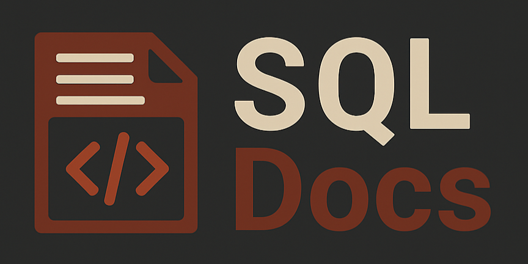
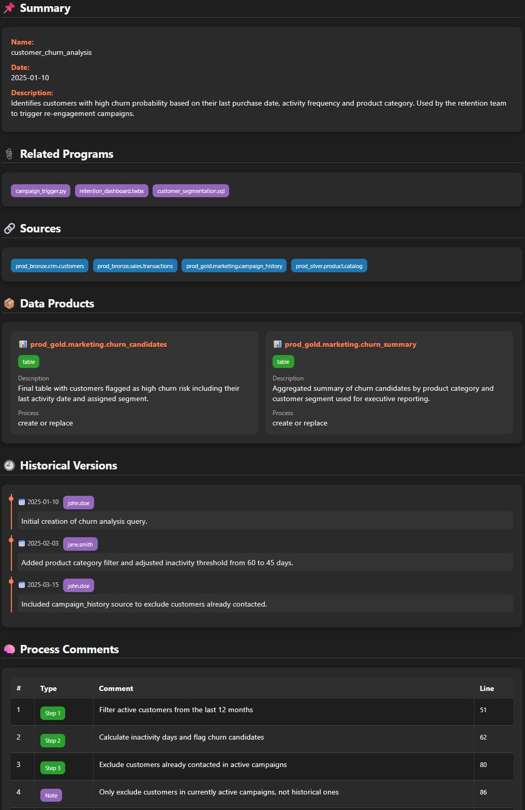

___________________________________________________________________________________________________________________________________________


SQL Docs is a framework designed to standardize SQL query documentation. Its goal is to provide a clear and consistent structure that improves readability, maintainability, and enables automatic HTML documentation generation.

It is highly recommended to use this framework to document your queries within your data pipelines, and then finalize the process with a Python script that generates documentation for each query.

___________________________________________________________________________________________________________________________________________

## 🎯 Objective

The framework is divided into 7 sections:
- Sections 1 to 5 must be completed before writing the SQL query.
- Sections 6 and 7 are used during query development to describe its different parts.
___________________________________________________________________________________________________________________________________________

## 📑 Framework Structure

* 1. Summary → Overview of the query’s purpose.
* 2. Related Programs → Related queries or processes.
* 3. Sources → Data sources used.
* 4. Products → Output of the query (table, view, insert, etc.).
* 5. Historical Versions → Change log.
* 6. Steps → Step-by-step explanation of the logic.
* 7. Notes (NT) → Additional observations about the query.
___________________________________________________________________________________________________________________________________________

## ⚠️ Important Notes

-   It is mandatory to follow the framework’s wording to allow for the subsequent automatic generation of HTML.
-   Sections can be omitted depending on project needs (this does not affect HTML export).
-   Each section must begin and end with the correct syntax.
___________________________________________________________________________________________________________________________________________

## 📦 Installation
```python
pip install sqldocs
```
___________________________________________________________________________________________________________________________________________

## 📑 Example use

```python
from sqldocs import generate_doc
from IPython.display import display, HTML

with open("customer_churn_analysis.sql", "r", encoding="utf-8") as f:
    sql_content = f.read()

doc = generate_doc(sql_content)

display(HTML(doc))
```
___________________________________________________________________________________________________________________________________________

## 📑 Details of each framework section:

- Summary: Brief summary of the purpose of the query.
  Created Date: xx/xx/xxxx
  Description: Technical/functional details about the operation of the query.
  References: E.g., ticket or issue number.

- Related Programs: List of other processes related to the query (e.g., other queries, PY files, processes, dashboards, etc.).
  Program: For example a query name.

- Sources: This section details each of the consumed data sources.
  source_1
  source_2
  source_3

- Product 1: Here you describe each of the products generated by the query, such as a table, view, insert, etc.
  Description: Brief description of the product.
  Name: Table/view name.
  Type: Table/View/Insert/Update/Delete.
  Process: Create or Replace / Truncate / etc.

- Historical Versions: A record of changes made to the query.
  Date -(User)- Description of the change.
  01/01/2025-(john.doe)- Initial creation.
  15/01/2025-(jane.smith)- Filter adjustment.

- Step 1: Short comment of the logic applied in the query. Used to divide it into stages, explaining the goal of each part of the process.

- NT: Special comments that apply to specific lines of the query, relevant for understanding the process.

___________________________________________________________________________________________________________________________________________

## 📑 HTML Example:


___________________________________________________________________________________________________________________________________________

## 📑 Framework to copy:

```sql
------------------------------------------------------------------
/* SUMMARY */
------------------------------------------------------------------
-- name: example_name
-- created_date: 2025-01-01
-- description: example description
-- references: Ticket 1234
------------------------------------------------------------------
/* RELATED PROGRAMS */
------------------------------------------------------------------
-- - Example.sql
-- - Example.sql
------------------------------------------------------------------
/* SOURCES */
------------------------------------------------------------------
-- - example.example.source
-- - prod_bronze.mktinfo.cotizacion_vt7
------------------------------------------------------------------
/* PRODUCTS */
------------------------------------------------------------------
-- - name: example_name
--   type: table
--   description: example description
--   process: create or replace

-- - name: example_name
--   type: table
--   description: example description
--   process: create or replace
------------------------------------------------------------------
/* HISTORICAL VERSIONS */
------------------------------------------------------------------
-- - date: 2025-01-01
--   user: Example User
--   description: created query

-- - date: 2025-01-01
--   user: Example User
--   description: created query
------------------------------------------------------------------
/* PROCESS COMMENTS */
------------------------------------------------------------------
-- STEP 1: use this for explain the main process
-- STEP 2: use this for explain the main process
-- STEP 3: use this for explain the main process
-- NT: special comment for a specific line
```
___________________________________________________________________________________________________________________________________________
